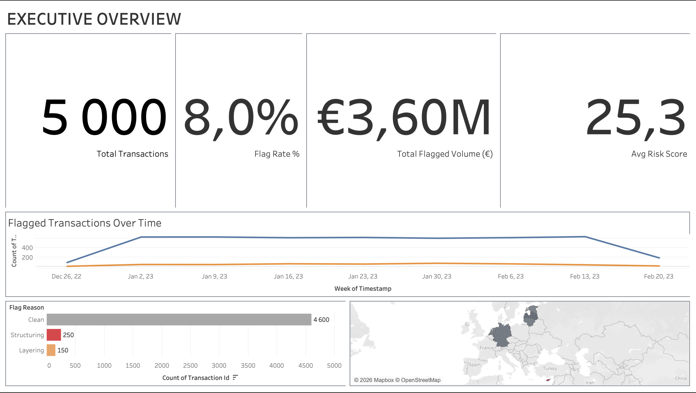
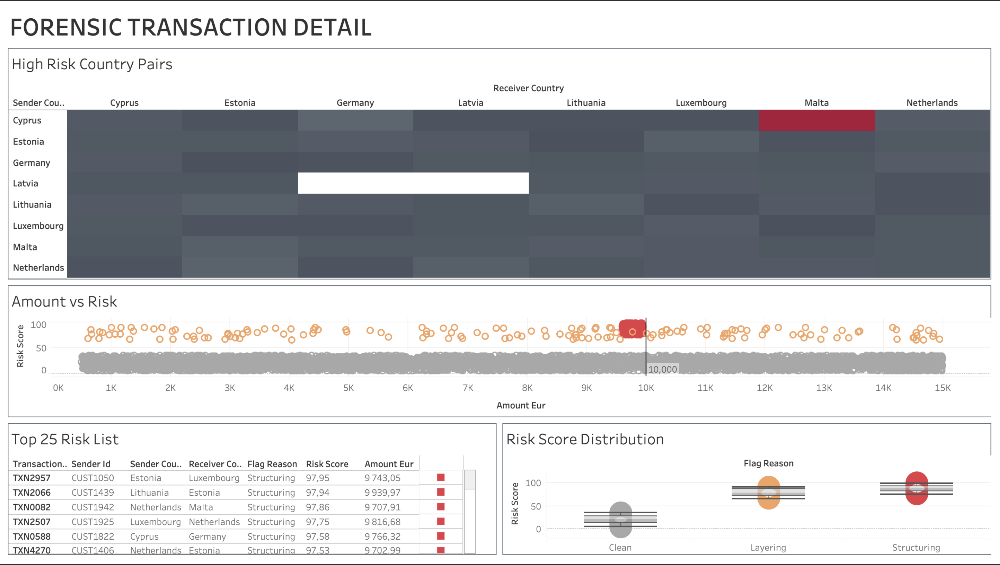

# 🚨 Paper Trail: AML Behavioral Intelligence & Risk Scoring Suite

## 📌 Project Overview
[cite_start]This project simulates a high-stakes **Anti-Money Laundering (AML)** monitoring environment[cite: 1, 2]. [cite_start]I engineered a synthetic dataset of 5,000 banking transactions to inject specific financial crime patterns—**Structuring (Smurfing)** and **Layering**—and built a multi-layered Tableau dashboard to identify, score, and rank suspicious activity[cite: 5, 9].

## 📊 Dashboard Previews

### Executive Overview
[cite_start]Focuses on high-level KPIs including a 8.0% Flag Rate and €3.60M in suspicious volume[cite: 8, 9, 13, 15].

### Forensic Detail
[cite_start]Deep dive into "Smurfing" patterns (clustering below €10k) and high-risk country corridors like Cyprus to Malta[cite: 52, 53, 61, 91].

## 🔍 Key Forensic Insights Surfaced
- [cite_start]**The "Smurfing" Signal:** Identified a massive cluster of transactions sitting between €9,000 - €9,999, specifically designed to evade the €10,000 mandatory reporting threshold[cite: 91, 118].
- [cite_start]**High-Risk Corridors:** Surface-level analysis identified Cyprus → Malta as a primary corridor for layering attempts[cite: 53, 61].
- [cite_start]**Risk Efficiency:** Isolated an **8% flag rate** across **€3.6M** in suspicious volume[cite: 9, 13, 15].
- [cite_start]**Suspect Prioritization:** Generated a "Top 25" list of individual transactions ranked by a multi-factor Risk Score[cite: 100, 101].

## 🛠️ Tech Stack & Methodology
- [cite_start]**Data Engineering:** Python (Pandas, NumPy) used to generate 5,000 records and inject anomalies[cite: 1, 9].
- [cite_start]**Risk Scoring:** Developed a behavioral logic to assign risk scores based on transaction amount and frequency[cite: 5, 16].
- [cite_start]**Analytics:** Statistical distribution analysis to catch "clustering" behavior[cite: 5, 91].

## 📂 Repository Navigation
- [Python Data Script](aml_data_engineering.py) - The logic used to build the "Fake Bank."
- [Transaction Dataset](transaction_dataset.csv) - The raw CSV used for analysis.
- [Tableau Workbook](AML_Forensic_Suite.twbx) - The full interactive dashboard.
- [cite_start][Project PDF](Paper_Trail_Project_Summary.pdf) - A printable summary of the suite.

---
**Author:** Mukunthan Balu | [cite_start]Data Analyst [cite: 6]
[cite_start]**Date:** 2026 [cite: 7]
